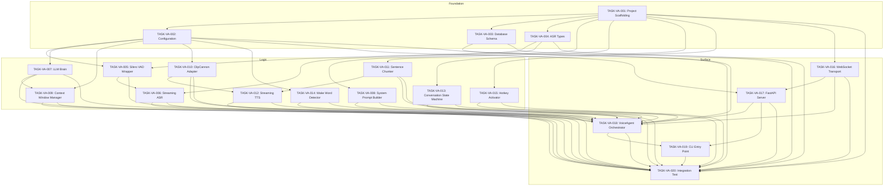

# Task Index: Voice Agent Phase 1 -- Core Voice Pipeline

## Overview
- **Total Tasks:** 20
- **Foundation:** 4 tasks (TASK-VA-001 through TASK-VA-004)
- **Logic:** 11 tasks (TASK-VA-005 through TASK-VA-015)
- **Surface:** 5 tasks (TASK-VA-016 through TASK-VA-020)
- **Current Progress:** 0/20 (0%)

## Dependency Graph



## Execution Order

| # | Task ID | Title | Layer | Depends On | Status |
|---|---------|-------|-------|------------|--------|
| 1 | TASK-VA-001 | Project Scaffolding | foundation | -- | Ready |
| 2 | TASK-VA-002 | Configuration | foundation | 001 | Blocked |
| 3 | TASK-VA-003 | Database Schema | foundation | 001 | Blocked |
| 4 | TASK-VA-004 | ASR Types | foundation | 001 | Blocked |
| 5 | TASK-VA-005 | Silero VAD Wrapper | logic | 002, 004 | Blocked |
| 6 | TASK-VA-006 | Streaming ASR | logic | 004, 005 | Blocked |
| 7 | TASK-VA-007 | LLM Brain | logic | 002 | Blocked |
| 8 | TASK-VA-008 | System Prompt Builder | logic | 001 | Blocked |
| 9 | TASK-VA-009 | Context Window Manager | logic | 002, 007 | Blocked |
| 10 | TASK-VA-010 | ClipCannon Adapter | logic | 002 | Blocked |
| 11 | TASK-VA-011 | Sentence Chunker | logic | 001 | Blocked |
| 12 | TASK-VA-012 | Streaming TTS | logic | 010, 011 | Blocked |
| 13 | TASK-VA-013 | Conversation State Machine | logic | 001 | Blocked |
| 14 | TASK-VA-014 | Wake Word Detector | logic | 002 | Blocked |
| 15 | TASK-VA-015 | Hotkey Activator | logic | 001 | Blocked |
| 16 | TASK-VA-016 | WebSocket Transport | surface | 001 | Blocked |
| 17 | TASK-VA-017 | FastAPI Server | surface | 002, 016 | Blocked |
| 18 | TASK-VA-018 | VoiceAgent Orchestrator | surface | 003, 006-017 | Blocked |
| 19 | TASK-VA-019 | CLI Entry Point | surface | 017, 018 | Blocked |
| 20 | TASK-VA-020 | Integration Test | surface | 001-019 (ALL) | Blocked |

## Status Legend
- Ready -- Can be started now
- In Progress -- Currently being worked on
- Complete -- Finished and verified
- Blocked -- Waiting on dependencies
- Failed -- Needs revision

## Critical Path
```
TASK-VA-001 --> TASK-VA-004 --> TASK-VA-005 --> TASK-VA-006 --> TASK-VA-018 --> TASK-VA-019 --> TASK-VA-020
```

TASK-VA-020 is the final gate. It depends on ALL 19 prior tasks and proves the entire Phase 1 pipeline works end-to-end with real GPU models, real audio, and real database writes.

## Parallel Opportunities
- **Batch 1:** TASK-VA-001 (sole starting task, no dependencies)
- **Batch 2:** TASK-VA-002, TASK-VA-003, TASK-VA-004 (all depend only on 001)
- **Batch 3:** TASK-VA-005, TASK-VA-007, TASK-VA-008, TASK-VA-010, TASK-VA-011, TASK-VA-013, TASK-VA-014, TASK-VA-015 (independent within logic layer, various foundation deps)
- **Batch 4:** TASK-VA-006 (depends on 005), TASK-VA-009 (depends on 007), TASK-VA-012 (depends on 010, 011)
- **Batch 5:** TASK-VA-016 (independent surface entry point)
- **Batch 6:** TASK-VA-017 (depends on 016)
- **Batch 7:** TASK-VA-018 (depends on most logic tasks + 016 + 017)
- **Batch 8:** TASK-VA-019 (depends on 017, 018)
- **Batch 9:** TASK-VA-020 (depends on ALL prior tasks -- final integration gate)
